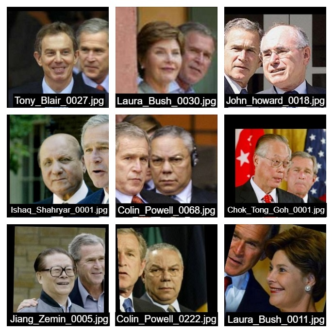
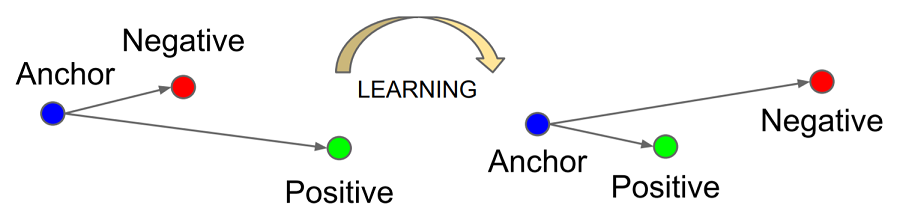
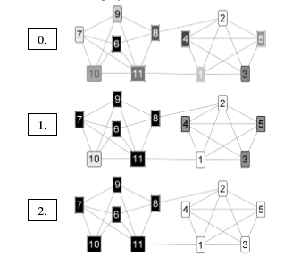

# Sort-By-Face
This is an application with which you can either sort all the pictures by faces from a corpus of photos or retrieve all your photos from the corpus  
by submitting a picture of yours.

# Setup:
## Requirements:
- ##### python 3.8.5
- ##### Anaconda 4.9.2+  
If anaconda isn't installed, install it from [here](https://www.anaconda.com/products/individual)

- Clone the repository
- Download the folder called `Models/` from [here](https://drive.google.com/drive/folders/16QKtJwQusmANayPykb4cvTpVPwzZVAE8?usp=sharing) into the same directory where you cloned the repository.
- Run `conda env create -f environment.yml` to create the environment.
- Run `conda activate sorter`.
- In case you want to run the [notebook](evaluate.ipynb) then make sure Jupyter notebook is installed and accessible for all environments in your system.

# Instructions:
- Put the directory where the folders are located into the project folder.
- Run `python embedder.py -src /path/to/images`. Any non image file extensions are safely ignored. This command utilizes all the cores in the system for parallel processing.
- In case you want to reduce the number of parallel processes, run `python embedder.py -src /path/to/images --processes number-of-processes`.
- Both absolute and relative paths work but relative paths are recommended.
- The above command then calculates all the embeddings for the faces in the pictures. NOTE: It takes a significant amount of time for large directories.
- The embeddings are saved in a pickle file called `embeddings.pickle`.
## Sort an entire corpus of photos:
- Run `python sort_images.py`. This runs the clustering algorithm with the default parameters of threshold and iterations for the clustering algorithm.
- If you want to tweak the parameters, run `python sort_images.py -t threshold -itr num-iterations` to alter the threshold and iterations respectively.
- If you think pictures are missing try reducing the threshold and increasing the iterations. Something like `0.64` and `35` iterations should work.
- Once the clustering is finished all the images are stored into a folder called `Sorted-pictures`. Each subdirectory in it corresponds to the unique person identified.

## Get pictures of a single person from the corpus:
- To get pictures of a single person you will need to provide a picture of that person. It is recommended that the picture clears the following requirements
for better results:
    - Image must have width and height greater than 160px.
    - Image must consist of only one face (The program is exited when multiple faces are detected)
    - Image must be preferably well lit and recognizable by a human.
- Run `python get_individual.py -src /path/to/person's/image -dest /path/to/copy/images`.
- This script also allows to tweak with the parameters with the same arguments as mentioned before.
- Once clustering is done all the pictures are copied into the destination

# Evaluation of clustering algorithm:
The notebook 
On testing on the Labeled Faces in the Wild dataset the following results were obtained. (threshold = 0.67, iterations=30)
- **Precision**: 0.89
- **Recall**: 0.99
- **F-measure**: 0.95
- **Clusters formed**: 6090 (5749 unique labels in the dataset)

The code for evaluation has been uploaded in this [notebook](evaluate.ipynb)

The LFW dataset has many images containing more than one face but only has a single label. This can have an effect on the evaluation metrics and the clusters formed. These factors have been discussed in detail in the [notebook](evaluate.ipynb).  
For example by running the script `get_individual.py` and providing a photo of George Bush will result in some images like this.  
     
In Layman terms we have gathered all the 'photobombs' of George Bush in the dataset, but all the labels for the 'photobombs' correspond to a different person.  
**NOTE**: this does not effect the clustering for the original person as the scripts treat each face seperately but refer to the same image.  
  

# How it works:
- Given a corpus of photos inside a directory this application first detects the faces in the photos.
- Face alignment is then done using dlib, such that the all the eyes for the faces is at the same coordinates.
- Then the image is passed through a Convolutional Neural Network to generate 128-Dimensional embeddings. 
- These embeddings are then used in a graph based clustering algorithm called 'Chinese Whispers'.  
- The clustering algorithm assigns a cluster to each individual identified by it.  
- After the algorithm the images are copied into seperate directories corresponding to their clusters.
- For a person who wants to retrieve only his images, only the images which are in the same cluster as the picture submitted by the user is copied.

## Model used for embedding extraction:
The project uses a model which was first introduced in this [[4] ](https://arxiv.org/abs/1503.03832). It uses a keras model converted from 
David Sandberg's implementation in [this](https://github.com/davidsandberg/facenet) repository.  
In particular it uses the model with the name `20170512-110547` which was converted using [this](https://github.com/nyoki-mtl/keras-facenet/blob/master/notebook/tf_to_keras.ipynb) script.

All the facenet models are trained using a loss called triplet loss. This loss ensures that the model gives closer embeddings for same people and farther embeddings for different people.  
The models are trained on a huge amount of images out of which triplets are generated.

## The clustering algorithm:
  
This project uses a graph based algorithm called Chinese Whispers to cluster the faces. It was first introduced for Natural Language Processing tasks by Chris Biemann in [[3] ](https://www.researchgate.net/publication/228670574_Chinese_whispers_An_efficient_graph_clustering_algorithm_and_its_application_to_natural_language_processing_problems) paper.   
The authors in [[1] ](https://repository.tudelft.nl/islandora/object/uuid:a9f82787-ac3d-4ff1-8239-4f3c1c6414b9)and [[2] ](https://www.hindawi.com/journals/cin/2019/6065056/)used the concept of a threshold to assign edges to the graphs. i.e there is an edge between two nodes (faces) only if their (dis)similarity metric of their representations is above/below a certain threshold.  
In this implementation I have used cosine similarity between face embeddings as the similarity metric.  

By combining these ideas we draw the graph like this:
1. Assign a node to every face detected in the dataset (not every image, because there can be multiple faces in a single image)
2. Add an edge between two nodes only if the cosine similarity between their embeddings is greater than a threshold.

And the algorithm used for clustering is:
1. Initially all the nodes are given a seperate cluster.
2. The algorithm does a specific number of iterations.
3. For each iteration the nodes are traversed randomly.
4. Each node is given the cluster which has the highest rank in it's neighbourhood.
5. The rank of a cluster here is the sum of weights between the current node and the neighbours belonging to that cluster.
6. In case of a tie between clusters, any one of them is assigned randomly.  

The Chinese Whispers algorithm does not converge nor is it deterministic, but it turns out be a very efficient algorithm for some tasks.

# References:
This project is inspired by the ideas presented in the following papers

[[1] ](https://repository.tudelft.nl/islandora/object/uuid:a9f82787-ac3d-4ff1-8239-4f3c1c6414b9)Roy Klip. Fuzzy Face Clustering For Forensic Investigations

[[2] ](https://www.hindawi.com/journals/cin/2019/6065056/)Chang L, Pérez-Suárez A, González-Mendoza M. Effective and Generalizable Graph-Based Clustering for Faces in the Wild.

[[3] ](https://www.researchgate.net/publication/228670574_Chinese_whispers_An_efficient_graph_clustering_algorithm_and_its_application_to_natural_language_processing_problems) Biemann, Chris. (2006). Chinese whispers: An efficient graph clustering algorithm and its application to natural language processing problems.  
[[4] ](https://arxiv.org/abs/1503.03832)Florian Schroff and Dmitry Kalenichenko and James Philbin (2015). FaceNet, a Unified Embedding for Face Recognition and Clustering.

# Libraries used:
- NumPy
- Tensorflow
- Keras
- dlib
- OpenCv
- networkx
- imutils
- tqdm
# Future Scope:
- A Graphical User Interface (GUI) to help users use the app with ease.
- GPU optimization to calculate embeddings.
- Implementation of other clustering methods.
